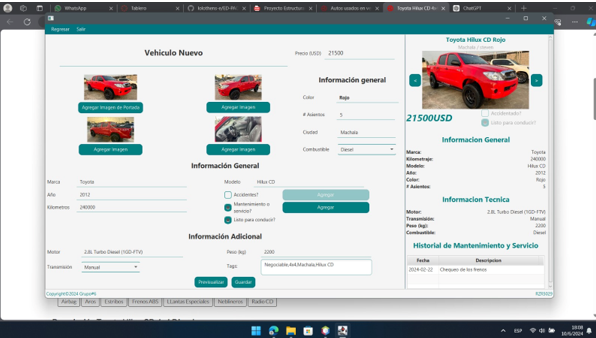
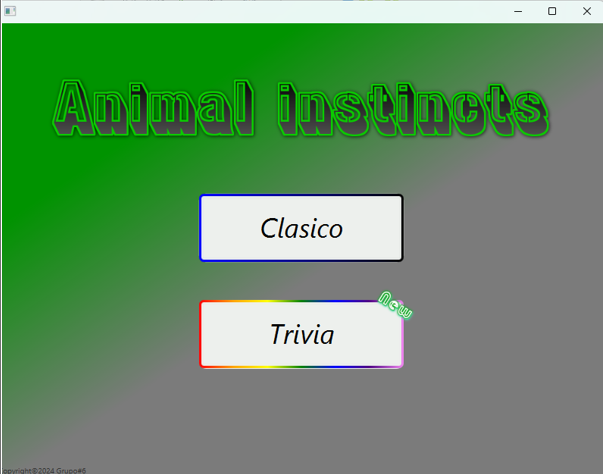

# Perfil Personal de GitHub – Anthony Navarrete Castillo

Este repositorio funciona como portafolio personal para la presentación de proyectos de desarrollo de software, habilidades técnicas relevantes e intereses académicos y profesionales.

Correo institucional: annacast@espol.edu.ec

---

## Índice

- [Información general](#información-general)
- [Proyectos destacados](#proyectos-destacados)
- [Tecnologías](#tecnologías)
- [Capturas de pantalla](#capturas-de-pantalla)
- [Información de contacto](#información-de-contacto)

---

## Información general

- Formación académica: Bachiller Técnico en Servicios Informáticos / Estudiante de Ingenieria en Computación (CS) en ESPOL.
- Áreas de interés: Dirección de proyectos informáticos, enlaces del área con sectores y ciencias humanísticas, inteligencia artificial, psicología y actuación teatral.
- Enfoque actual: Ninguno al momento.
- Tecnologías en aprendizaje: Python / Java / C & C# / SQL / HTML & CSS.

---

## Proyectos destacados

### [ReAuto]([https://github.com/lolothens-e/ED-PAO1-2024-P1-6])

- Descripción: Plataforma de compra y venta de autos (Simulación)
- Tecnologías utilizadas: Java, JavaFX, SceneBuilder
- Estado: Finalizado (Fines Académicos)
- Funcionalidades principales:
  - Métodos de búsqueda básica en lista.
  - Creación de elementos e iteraciones de litas.
  - Manejo de estructuras de datos.

---

### [Adivina Animal]([https://github.com/lolothens-e/ED-PAO1-2024-P2-6])

- Descripción: Proyecto parcial de materia Estructura de Datos, uso de JavaUtil y estructuras de datos, para organización arbórea de elementos. Presentación en forma de juego concurso.
- Tecnologías utilizadas: Java, JavaFX, SceneBuilder
- Estado: Finalizado (Fines Académico)
- Funcionalidades principales:
  - Uso de concurrencia.
  - Manejo de excepciones en estructuras de datos.
  - Interfaces interactivas.
  - Manejo de Archivos.

---
### [Casi Millonario]([(https://github.com/vicbguti-espol/POO-P3-G07/tree/main])

- Descripción: Proyecto final de materia Programación Orientada a Objetos. Programa juego concurso simulando "Quien quiere ser millonario".
- Tecnologías utilizadas: Java, JavaFX, SceneBuilder, HTML, CSS, JS.
- Estado: Finalizado (Fines Académico)
- Funcionalidades principales:
  - Uso de concurrencia.
  - Manejo de excepciones.
  - Interfaces interactivas.
  - Manejo de Archivos.

---

## Tecnologías

Resumen de lenguajes de programación, frameworks y herramientas utilizados en los distintos proyectos:

| Lenguajes de Programación | Frameworks y Librerías | Herramientas y Plataformas |
|---------------------------|------------------------|-----------------------------|
| Python                    | numpy                  | Git, GitHub                 |
| JavaScript                |                        | VS Code                     |
| HTML, CSS                 |                        | Figma & Trello              |
| Java                      |                        | Linux/UNIX                  |
| SQL                       |                        | Eclipse / NetBeans          |
| C                         |                        |                             |

---

## Capturas de pantalla

Las siguientes imágenes ilustran algunas interfaces y elementos técnicos relevantes de los proyectos:

### Proyecto 1

`/assets/proyecto1-captura.png`  

### Proyecto 2

`/assets/proyecto2-captura.png`  

---

## Información de contacto
- LinkedIn: [https://linkedin.com/in/tu-perfil](https://linkedin.com/in/lolothens-e)

---

Este documento se mantiene con fines académicos y profesionales. Los proyectos se actualizan de manera continua conforme avanza su desarrollo.
